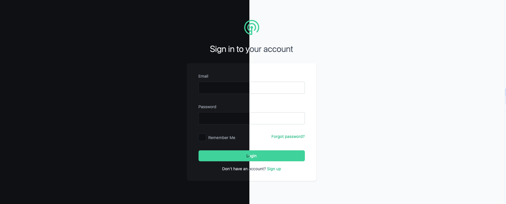
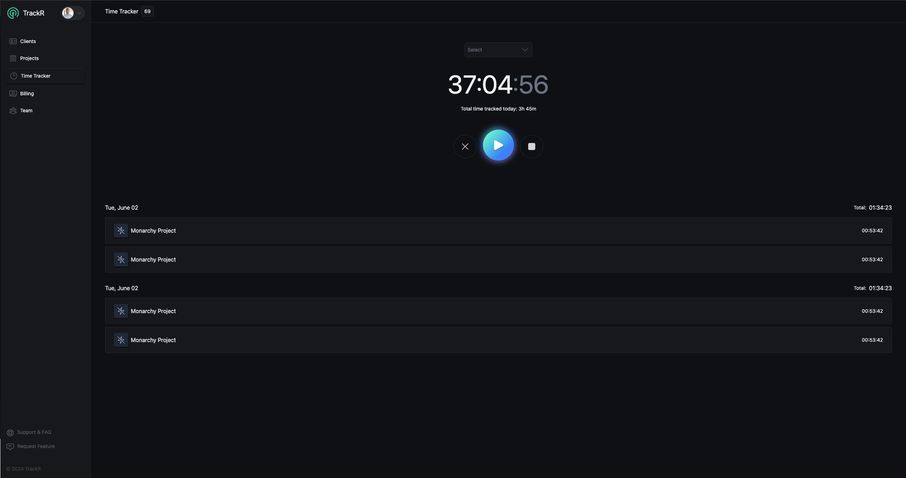

# TrakR the Time Tracking App

### Description

Similar to apps like Harvest, you can track billable hours for your clients and projects, as well as, team management. Maybe, eventually, will be able to view important metrics and generate invoices. This app is a work-in-progress project and may never be as robust as Harvest and others because this is being built for fun. 




### Environment Variables

When you want to create a new environment variable, create them in the `.env.example` then run the following:

```shell
pnpm run env:gen
```

This will sync the environment variables in your `.env.example` with your `.env` and generate types for your environment variables. Existing values in your `.env` will not be overwritten unless you removed the variables from your `.env.example`.

When you need to retrieve values from your environment variables, use the following

```typescript
import { getEnv } from '~/utils/env';

getEnv('YOUR_ENV_VARIABLE');
```

This will ensure you will receive the values properly, regardless if you are on the client or on the server. And it is type safe!

Note that to access environment variables on the client would require the variables to be prefixed with `VITE_` in your `.env` files. It may be a good idea to have two of the same environment variables in your `.env` files, one prefixed with `VITE_` and one without, to prevent an errors and the variables prefixed with `VITE_` will not be generated with the types. Meaning `getEnv('MY_VARIABLE')` will work while `getEnv('VITE_MY_VARIABLE')` will not work.

- 📖 [Remix docs](https://remix.run/docs)

## Development

Run the dev server:

```shellscript
npm run dev
```

## Deployment

First, build your app for production:

```sh
npm run build
```

Then run the app in production mode:

```sh
npm start
```

Now you'll need to pick a host to deploy it to.

### DIY

If you're familiar with deploying Node applications, the built-in Remix app server is production-ready.

Make sure to deploy the output of `npm run build`

- `build/server`
- `build/client`

## Styling

This template comes with [Tailwind CSS](https://tailwindcss.com/) already configured for a simple default starting experience. You can use whatever css framework you prefer. See the [Vite docs on css](https://vitejs.dev/guide/features.html#css) for more information.
